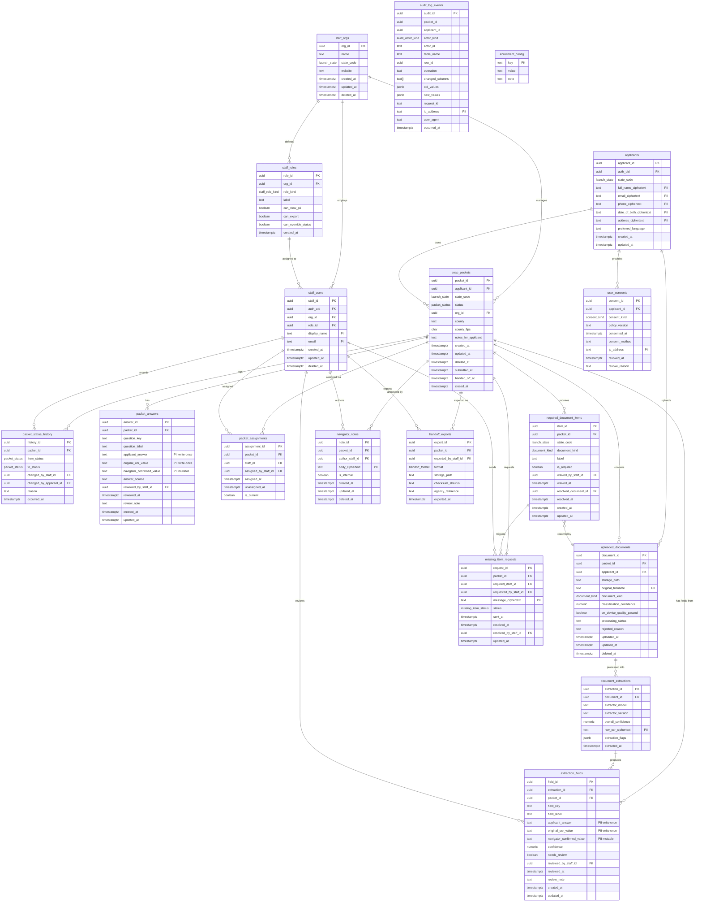

# SNAP Enrollment-Readiness — ERD

Schema: `snap_enrollment`

## Key design notes

- **Status lifecycle** (`snap_packets.status`): `Draft` → `Submitted for Review` → `In Navigator Review` → `Ready for Handoff` → `Handed Off` → `Closed`. Detours via `Needs Documents` / `Needs Applicant Clarification` are allowed. Enforced by a `BEFORE UPDATE` trigger.
- **Three-value preservation**: `applicant_answer` and `original_ocr_value` are write-once on both `packet_answers` and `extraction_fields`. `navigator_confirmed_value` is the only mutable value column.
- **`needs_review`** is a generated column (`confidence < 0.85`). The guard trigger counts rows where `needs_review = true AND reviewed_at IS NULL`.
- **Audit log**: `audit_log_events` is append-only (mutation blocked by trigger). `packet_id` and `applicant_id` are denormalised (not FK) so audit records survive hard-delete of applicant data.
- **Consent withdrawal** = hard-delete on `applicants` row → cascades to `snap_packets`, `uploaded_documents`, `packet_answers`, `extraction_fields`, `user_consents`. `audit_log_events` is intentionally NOT cascaded.
- **`handoff_exports`**, **`user_consents`**, **`packet_status_history`** are append-only via `BEFORE UPDATE/DELETE` triggers.
- **PII grep recipe**: `grep -rn "COMMENT 'PII'" supabase/migrations/`
